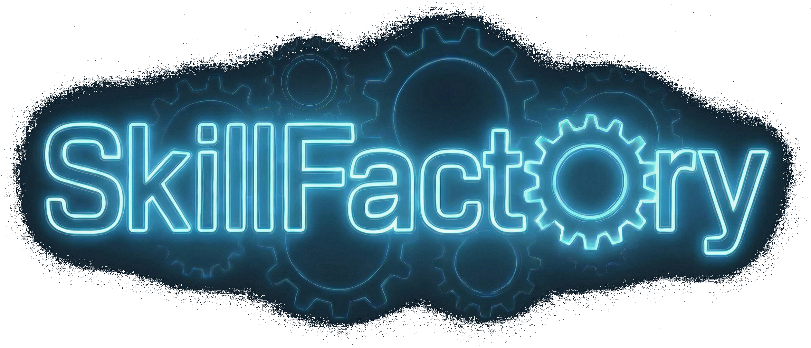
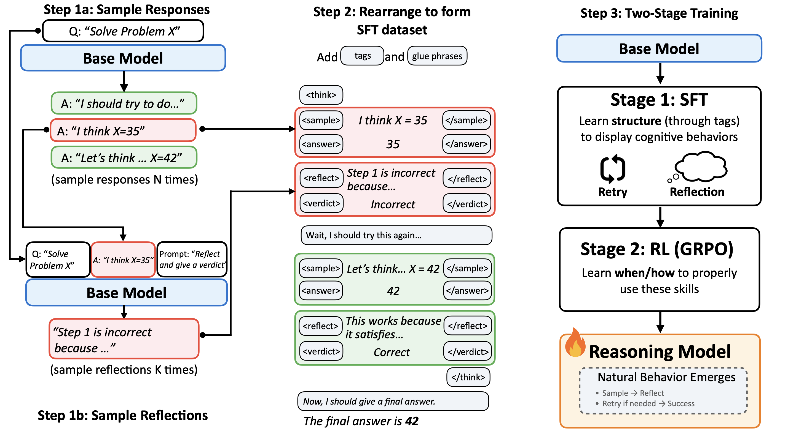

<div align="center">
  <!--  -->
  
  <br>
  <h1>SkillFactory: Self-Distillation for Learning Cognitive Behaviors</h1>
  <h4>Scripts for creating cognitive behavior primed SFT data</h4>
</div>
<p align="center">
  <a href="https://huggingface.co/SkillFactory">
        
  </a>

  <a href="https://github.com/Zayne-sprague/SkillFactory/blob/main/LICENSE">
    
  </a>

  <a href="">
    
  </a>
</p>

---

This is the official code for the paper [SkillFactory: Self-Distillation for Learning Cognitive Behaviors](). In this repo, we provide the code for extracting reflections and verification data and reformatting them into SkillFactory traces.



## Quick Start

### Installation
```bash
virtualenv venv 
source venv/bin/activate
pip install -r requirements.txt
```

### Example Data Creation Script
```bash
# This runs data creation with reflection traces using default parameters
bash examples/reflection.sh --input-dataset TAUR-dev/9_8_25__countdown_3arg__sft_data_multiprompts_reflections --output-dataset TAUR-dev/skillfactory_sft_countdown_3arg

# You can also specify custom input and output datasets:
bash examples/reflection.sh --input-dataset "your-input-dataset" --output-dataset "your-output-dataset"

# Or use short flags:
bash examples/reflection.sh -i "your-input-dataset" -o "your-output-dataset"
```

## SkillFactory Data Creation
Our data creation code is provided in [skill_factory/sft_data_creation.py](skill_factory/sft_data_creation.py), and we have example scripts in [examples/](examples/).

For an example of what the dataset should look like, see `TAUR-dev/9_8_25__countdown_3arg__sft_data_multiprompts_reflections`.

## Training
Our SFT was performed using [LLaMA-Factory](https://github.com/hiyouga/LLaMA-Factory) and our RL was performed using [verl
](https://github.com/volcengine/verl). We do not include these modules in this repo release, but we recommend you forking and running from those.

### LLaMa-Factory

For SFT training, you can create the SFT dataset via `sft_data_creation.py` which will upload a huggingface repo. Take that repo and plug it into your `data/datasets.json` within LLaMA-Factory.

```json
{
  ...
  "example_dataset": {
    "hf_hub_url": "hf_url",
    "formatting": "sharegpt",
    "columns": {
      "messages": "conversations"
    },
    "tags": {
      "user_tag": "user",
      "assistant_tag": "assistant",
      "role_tag": "role",
      "content_tag": "content"
    },
    "subset": "sft_train"
  }
}
  ```

Once done, you can use the template yaml file in `examples/llamafactory_sft_example.yaml` for training with LLaMA-Factory.

## Verl

Here is an example command we used to train our models with Verl

```bash
python -m verl.trainer.main_ppo \
  \
  # === Trainer / run config ===
  trainer.total_epochs=50 \
  trainer.save_freq=25 \
  trainer.test_freq=25 \
  trainer.val_before_train=True \
  trainer.logger=[console,wandb] \
  trainer.project_name=SkillFactory \
  trainer.experiment_name=experiment_name \
  trainer.nnodes=1 \
  trainer.n_gpus_per_node=4 \
  trainer.default_local_dir=/path/to/verl/checkpoints \
  \
  # === Algorithm (PPO / GRPO etc.) ===
  algorithm.adv_estimator=grpo \
  algorithm.kl_ctrl.kl_coef=0.001 \
  \
  # === Data ===
  data.train_files=/path/to/data/train.parquet \
  data.val_files=/path/to/data/val.parquet \
  data.train_batch_size=256 \
  data.max_prompt_length=512 \
  data.max_response_length=4096 \
  \
  # === Rollout config ===
  actor_rollout_ref.rollout.n=16 \
  actor_rollout_ref.rollout.max_num_batched_tokens=16384 \
  actor_rollout_ref.rollout.max_num_seqs=2048 \
  actor_rollout_ref.rollout.tensor_model_parallel_size=1 \
  actor_rollout_ref.rollout.gpu_memory_utilization=0.8 \
  actor_rollout_ref.rollout.log_prob_micro_batch_size_per_gpu=2 \
  actor_rollout_ref.rollout.dtype=bfloat16 \
  \
  # === Actor / ref model optimization ===
  actor_rollout_ref.actor.optim.lr=1e-06 \
  actor_rollout_ref.actor.ppo_mini_batch_size=32 \
  actor_rollout_ref.actor.ppo_micro_batch_size_per_gpu=1 \
  actor_rollout_ref.ref.log_prob_micro_batch_size_per_gpu=2 \
  actor_rollout_ref.actor.strategy=fsdp2 \
  actor_rollout_ref.actor.fsdp_config.forward_prefetch=True \
  actor_rollout_ref.ref.fsdp_config.forward_prefetch=True \
  \
  # === Policy / critic models ===
  actor_rollout_ref.model.path=/path/to/prefetched_model \
  actor_rollout_ref.model.enable_gradient_checkpointing=True \
  actor_rollout_ref.model.enable_activation_offload=True \
  actor_rollout_ref.model.use_remove_padding=True \
  actor_rollout_ref.model.trust_remote_code=True \
  \
  critic.model.path=/path/to/prefetched_model \
  critic.optim.lr=1e-05 \
  critic.ppo_micro_batch_size_per_gpu=1 \
  critic.model.trust_remote_code=True \
  \
  # === Reward model / custom reward ===
  reward_model.reward_manager=batch \
  reward_model.launch_reward_fn_async=True \
  reward_model.model.fsdp_config.forward_prefetch=True \
  custom_reward_function.name=compute_score_batch \
  custom_reward_function.path=/path/to/verl/rewards_fn \
  \
  # === Hydra output dirs ===
  hydra.run.dir=/path/to/workflow_out/hydra \
  hydra.output_subdir=null \
  hydra.job.chdir=False
  ```

Our reward function extracted text inside `<answer>` tags and checked for equivalence of a gold label. This is very similar to the examples given by the verl repo.

## Citation
```
@article{sprague2025skillfactory,
  title={SkillFactory: Self-Distillation for Learning Cognitive Behaviors},
  author={Sprague, Zayne and Lu, Jack and Wadhwa, Manya and Keh, Sedrick and Ren, Mengye and Durrett, Greg},
  journal={arXiv preprint (insert-arxiv-number-here)},
  year={2025}
}
```

## Acknowledgements