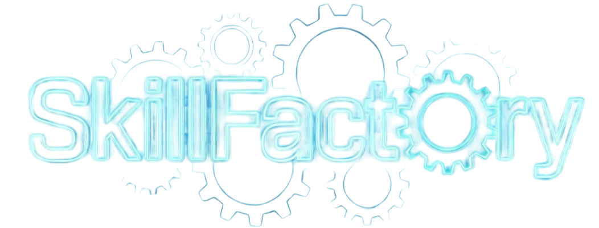

<div align="center">
  <!--  -->
  
  <br>
  <h1>SkillFactory: Self-Distillation for Learning Cognitive Behaviors</h1>
  <h4>Scripts for creating cognitive behavior primed SFT data</h4>
</div>
<p align="center">
  <a href="https://huggingface.co/SkillFactory">
        
  </a>

  <a href="https://github.com/Zayne-sprague/SkillFactory/blob/main/LICENSE">
    
  </a>

  <a href="">
    
  </a>
</p>

---

This is the official code for the paper [SkillFactory: Self-Distillation for Learning Cognitive Behaviors](). In this repo, we provide the code for extracting reflections and verification data and reformatting them into SkillFactory traces.


## Quick Start

### Installation
```bash
virtualenv venv 
source venv/bin/activate
pip install -r requirements.txt
```

### Example Data Creation Script
```bash
# This runs data creation with reflection traces using default parameters
bash examples/reflection.sh --input-dataset TAUR-dev/9_8_25__countdown_3arg__sft_data_multiprompts_reflections --output-dataset TAUR-dev/skillfactory_sft_countdown_3arg

# You can also specify custom input and output datasets:
bash examples/reflection.sh --input-dataset "your-input-dataset" --output-dataset "your-output-dataset"

# Or use short flags:
bash examples/reflection.sh -i "your-input-dataset" -o "your-output-dataset"
```

## SkillFactory Data Creation
Our data creation code is provided in [skill_factory/sft_data_creation.py](skill_factory/sft_data_creation.py), and we have example scripts in [examples/](examples/).

For an example of what the dataset should look like, see `TAUR-dev/9_8_25__countdown_3arg__sft_data_multiprompts_reflections`.

## Training
Our SFT was performed using [LLaMA-Factory](https://github.com/hiyouga/LLaMA-Factory) and our RL was performed using [verl
](https://github.com/volcengine/verl). We do not include these modules in this repo release, but we recommend you forking and running from those.

### LLaMa-Factory

For SFT training, you can create the SFT dataset via `sft_data_creation.py` which will upload a huggingface repo. Take that repo and plug it into your `data/datasets.json` within LLaMA-Factory.

```json
{
  ...
  "example_dataset": {
    "hf_hub_url": "hf_url",
    "formatting": "sharegpt",
    "columns": {
      "messages": "conversations"
    },
    "tags": {
      "user_tag": "user",
      "assistant_tag": "assistant",
      "role_tag": "role",
      "content_tag": "content"
    },
    "subset": "sft_train"
  }
}
  ```

Once done, you can use the template yaml file in `examples/llamafactory_sft_example.yaml` for training with LLaMA-Factory.

## VeRL


## Citation
```
@article{sprague2025skillfactory,
  title={SkillFactory: Self-Distillation for Learning Cognitive Behaviors},
  author={Sprague, Zayne and Lu, Jack and Wadhwa, Manya and Keh, Sedrick and Ren, Mengye and Durrett, Greg},
  journal={arXiv preprint (insert-arxiv-number-here)},
  year={2025}
}
```

## Acknowledgements